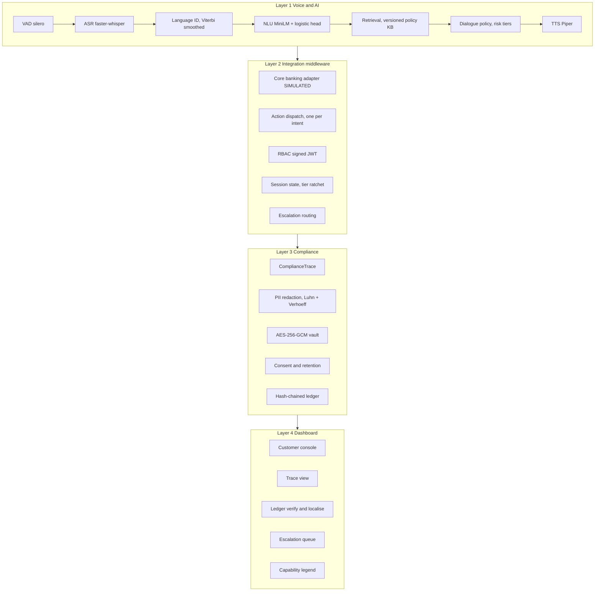
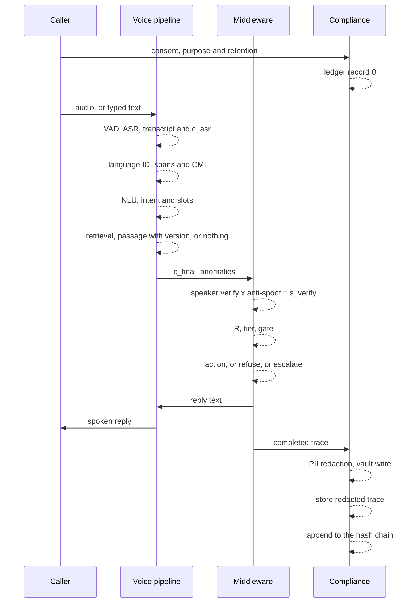
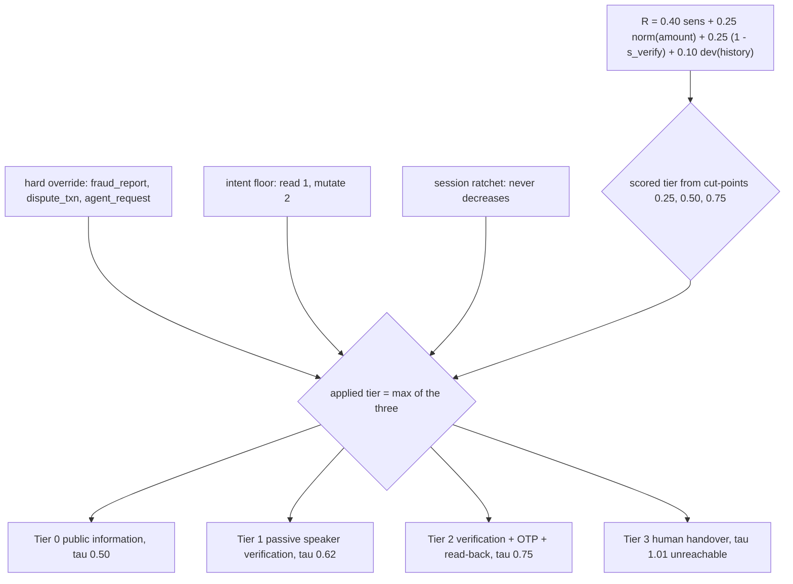
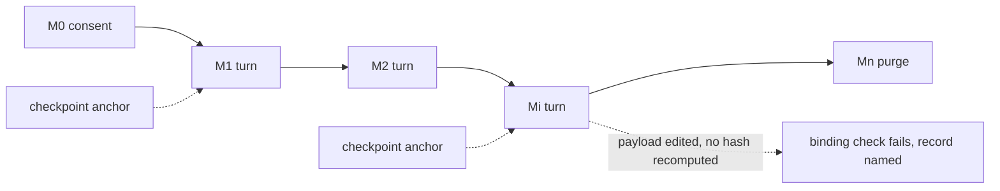
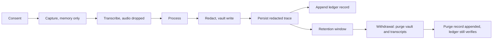

# Figures, Mermaid source

These render inline on GitHub. The publication-quality PNG and SVG versions in
this directory are generated by `scripts/diagrams/generate.py` (`make diagrams`).

## Figure 1. Four-layer architecture

## Figure 2. One turn

## Figure 3. Risk tiers

## Figure 4. Ledger

## Figure 5. Data lifecycle

